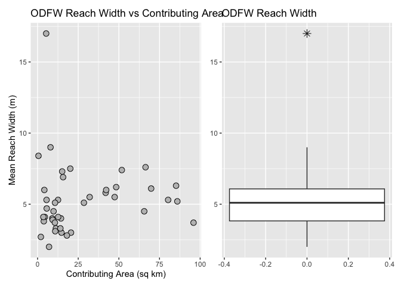
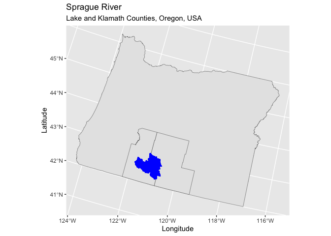
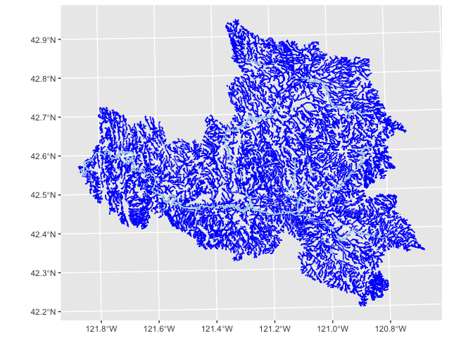

# ChannelGeometry


This document provides a quick look at some of the results reported in
Lex’s Sprague_Reach_Habitat_updated.csv file. Let’s start with the ODFW
reach data.

``` r
library(data.table)
library(stats)
library(ggplot2)
library(patchwork)

datafile <- "c:/work/sandbox/repos/Sprague/Sprague_Reach_Habitat_updated.csv"
data <- as.data.table(read.csv(datafile))
reach_width <- data[ACW>0, .(AREA_SQKM, SPRAG14RCH, ACW)]
widths <- reach_width[, .(width = mean(ACW, na.rm = TRUE)), by = SPRAG14RCH]
areas <- reach_width[, .(area = mean(AREA_SQKM, na.rm = TRUE)), by = SPRAG14RCH]
width_reach <- merge(widths, areas, by = "SPRAG14RCH")
p_pnts <- ggplot(width_reach, aes(x=area,y=width)) +
  geom_point(shape=21, size=3, color='black', fill='gray') +
  labs(title="ODFW Reach Width vs Contributing Area",
       x="Contributing Area (sq km)",
       y="Mean Reach Width (m)")
p_box <- ggplot(width_reach, aes(y=width)) +
  geom_boxplot(outlier.color="black", outlier.shape=8, outlier.size=3) +
  labs(title="ODFW Reach Width") +
  theme(axis.title.y = element_blank())
p_pnts + p_box
```



The 17-m wide reach appears to be an outlier compared to the other
values.

``` r
# Remove the apparent outlier
width_reach <- width_reach[width < 17]

# Fit a power function to the data, starting values from Excel
m_width <- nls(width ~ a * area^b,
               data = width_reach,
               start = list(a = 4.4, b = 0.0354))
m_width
```

    Nonlinear regression model
      model: width ~ a * area^b
       data: width_reach
         a      b 
    4.3220 0.0522 
     residual sum-of-squares: 107.6

    Number of iterations to convergence: 5 
    Achieved convergence tolerance: 2.963e-06

``` r
# Plot the data and the fitted line
fit <- predict(m_width, newdata=width_reach)
p_width_reach <- ggplot(width_reach, aes(x=area,y=width)) +
  geom_point(shape=21, size=3, color='black', fill='gray') +
  geom_line(aes(x=width_reach$area, y=fit), linewidth=1.3, color='black') +
  labs(title="ODFW Reach Width vs Contributing Area",
       x="Contributing Area (sq km)",
       y="Mean Reach Width (m)")
p_width_reach
```



``` r
# Take a look at the channel depth values
reach_depth <- data[ACH>0, .(AREA_SQKM, SPRAG14RCH, ACH)]
depths <- reach_depth[, .(depth = mean(ACH, na.rm = TRUE)), by = SPRAG14RCH]
areas <- reach_depth[, .(area = mean(AREA_SQKM, na.rm = TRUE)), by = SPRAG14RCH]
depth_reach <- merge(depths, areas, by = "SPRAG14RCH")
p_pnts <- ggplot(depth_reach, aes(x=area,y=depth)) +
  geom_point(shape=21, size=3, color='black', fill='gray') +
  labs(title="ODFW Reach Depth vs Contributing Area",
       x="Contributing Area (sq km)",
       y="Mean Reach Depth (m)")
p_pnts
```



Hmm, this shows channel depth decreasing with increasing contributing
area.
