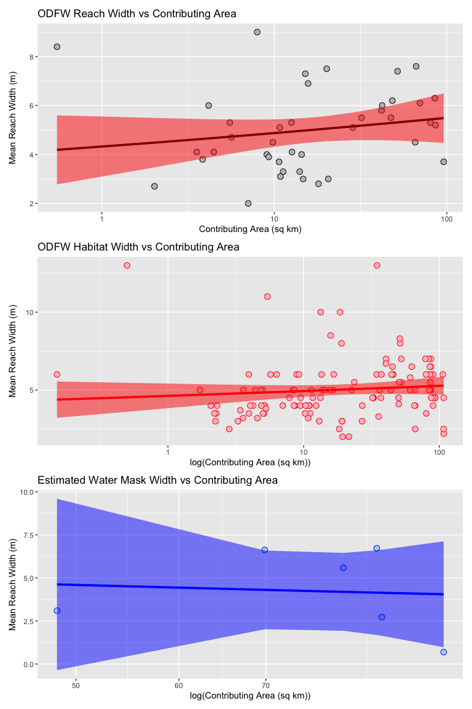
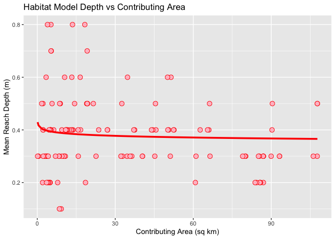

# ChannelGeometry


This document provides a quick look at some of the results reported in
Lex’s Sprague_Reach_Habitat_updated.csv file. Let’s start with the ODFW
reach data.

Before we start modeling, let’s take a look at the study area. Our goal
is to create a model of channel depth in width in the Sprague River,
located in southern Oregon. It is mapped below:


This river is a tributary of the Williamson River, which accounts for
most of the inflow to Upper Klamath Lake. Let’s take a closer look at
the channel network.

``` r
ggplot() +
  geom_sf(data = sprague, col = 'blue')
```


As shown on the plot, this river has an intricate stream network. Most
of the Sprague’s channels are considered small (\<5 m in width), making
them hard to obtain accurate geometry measurements. Additionally, the
number of channels makes the river difficult to comprehensively survey.

The Oregon Department of Fish and Wildlife has conducted two surveys of
the Sprague. The reach survey focused on documenting channel geometry
for river reaches, and the habitat survey focused on documenting channel
geometry for different habitat units. Our goal is to use these
measurements to improve existing channel geometry models and tailor them
to the Sprague. Let’s examine the reach survey data.

``` r
datafile <- "/Users/alexahaucke/Documents/GitHub/ChannelGeometry/Sprague_Reach_Habitat_updated.csv"
data <- as.data.table(read.csv(datafile))
reach_width <- data[ACW>0, .(AREA_SQKM, SPRAG14RCH, ACW)]
reach_widths <- reach_width[, .(width = mean(ACW, na.rm = TRUE)), by = SPRAG14RCH]
reach_areas <- reach_width[, .(area = mean(AREA_SQKM, na.rm = TRUE)), by = SPRAG14RCH]
width_reach <- merge(reach_widths, reach_areas, by = "SPRAG14RCH")
p_pnts <- ggplot(width_reach, aes(x=area,y=width)) +
  geom_point(shape=21, size=3, color='black', fill='gray') +
  labs(title="ODFW Reach Width vs Contributing Area",
       x="Contributing Area (sq km)",
       y="Mean Reach Width (m)")
p_box <- ggplot(width_reach, aes(y=width)) +
  geom_boxplot(outlier.color="black", outlier.shape=8, outlier.size=3) +
  labs(title="ODFW Reach Width", ) +
  theme(axis.title.y = element_blank(), plot.title = element_text(hjust = 0.5))
p_pnts + p_box
```


The 17-m wide reach appears to be an outlier compared to the other
values.

``` r
# Remove the apparent outlier
width_reach <- width_reach[width < 17]

# Fit a power function to the data, starting values from Excel
m_width <- nls(width ~ a * area^b,
               data = width_reach,
               start = list(a = 4.4, b = 0.0354))
m_width
```

    Nonlinear regression model
      model: width ~ a * area^b
       data: width_reach
         a      b 
    4.3220 0.0522 
     residual sum-of-squares: 107.6

    Number of iterations to convergence: 5 
    Achieved convergence tolerance: 2.98e-06

``` r
# Plot the data and the fitted line
fit <- predict(m_width, newdata=width_reach)
p_width_reach <- ggplot(width_reach, aes(x=area,y=width)) +
  geom_point(shape=21, size=3, color='black', fill='gray') +
  geom_line(aes(x=width_reach$area, y=fit), linewidth=1.3, color='black') +
  labs(title="ODFW Reach Width vs Contributing Area",
       x="Contributing Area (sq km)",
       y="Mean Reach Width (m)")
p_width_reach
```


## Width Regressions

Let’s compare these results to other survey data.

``` r
# Stack the widths
width_long <- melt(data, 
                   id.vars = c("SPRAG14RCH", "AREA_SQKM"),
                   measure.vars = c("ACW", "AC_WIDTH", "MaskWidth"),
                   variable.name = "width_type",
                   value.name = "width")
width_long <- width_long[width > 0]

# Then average by reach
width_long <- width_long[, .(width = mean(width, na.rm = TRUE),
                              area = mean(AREA_SQKM, na.rm = TRUE)), by = SPRAG14RCH]
```

Rerun the model

``` r
# (Optionally) remove outliers
width_long <- width_long[width < 17]
areas <- width_long$area

# Fit power model again
m_width <- nls(width ~ a * area^b,
               data = width_long,
               start = list(a = 4.4, b = 0.0354))
summary(m_width)
```


    Formula: width ~ a * area^b

    Parameters:
      Estimate Std. Error t value Pr(>|t|)    
    a  4.04443    0.60259   6.712 4.74e-08 ***
    b  0.08209    0.04701   1.746   0.0884 .  
    ---
    Signif. codes:  0 '***' 0.001 '**' 0.01 '*' 0.05 '.' 0.1 ' ' 1

    Residual standard error: 1.684 on 40 degrees of freedom

    Number of iterations to convergence: 6 
    Achieved convergence tolerance: 2.482e-06

``` r
##Create width model
synthetic_width <- function(DA) {
  synthetic_widths <- 4.044*DA^0.08209
  return(synthetic_widths)
}

synthetic_widths <- synthetic_width(areas)
```

Next, let’s see if the different surveys give different model results.
First, the reach survey:

``` r
# Fit power model again
m_width_reach <- nls(width ~ a * area^b,
               data = width_reach,
               start = list(a = 4.4, b = 0.0354))
summary(m_width_reach)
```


    Formula: width ~ a * area^b

    Parameters:
      Estimate Std. Error t value Pr(>|t|)    
    a  4.32197    0.62767   6.886 3.08e-08 ***
    b  0.05220    0.04689   1.113    0.272    
    ---
    Signif. codes:  0 '***' 0.001 '**' 0.01 '*' 0.05 '.' 0.1 ' ' 1

    Residual standard error: 1.661 on 39 degrees of freedom

    Number of iterations to convergence: 5 
    Achieved convergence tolerance: 2.98e-06

``` r
hab_width <- data[AC_WIDTH>0, .(AREA_SQKM, SPRAG14HAB, AC_WIDTH)]
hab_widths <- hab_width[, .(width = mean(AC_WIDTH, na.rm = TRUE)), by = SPRAG14HAB]
hab_areas <- hab_width[, .(area = mean(AREA_SQKM, na.rm = TRUE)), by = SPRAG14HAB]
width_habitat <- merge(hab_widths, hab_areas, by = "SPRAG14HAB")
# (Optionally) remove outliers
width_habitat <- width_habitat[width < 17]

# Fit power model again
m_width_habitat <- nls(width ~ a * area^b,
               data = width_habitat,
               start = list(a = 4.4, b = 0.0354))
summary(m_width_habitat)
```


    Formula: width ~ a * area^b

    Parameters:
      Estimate Std. Error t value Pr(>|t|)    
    a  4.62478    0.40339  11.465   <2e-16 ***
    b  0.02836    0.02693   1.053    0.294    
    ---
    Signif. codes:  0 '***' 0.001 '**' 0.01 '*' 0.05 '.' 0.1 ' ' 1

    Residual standard error: 1.89 on 122 degrees of freedom

    Number of iterations to convergence: 3 
    Achieved convergence tolerance: 7.648e-06

``` r
mask_widths <- data[MaskWidth>0, .(AREA_SQKM, SPRAG14RCH, MaskWidth)]
mask_widths <- data[, .(width = mean(MaskWidth, na.rm = TRUE)), by = SPRAG14RCH]
width_mask <- merge(mask_widths, reach_areas, by = "SPRAG14RCH")

# (Optionally) remove outliers
width_mask <- width_mask[width < 17]
width_mask <- width_mask[width > 0]

# Fit power model again
m_width_mask <- nls(width ~ a * area^b,
               data = width_mask,
               start = list(a = 4.4, b = 0.0354))
summary(m_width_mask)
```


    Formula: width ~ a * area^b

    Parameters:
      Estimate Std. Error t value Pr(>|t|)
    a   9.7480    47.1840   0.207    0.846
    b  -0.1924     1.1217  -0.171    0.872

    Residual standard error: 2.72 on 4 degrees of freedom

    Number of iterations to convergence: 10 
    Achieved convergence tolerance: 4.776e-06

All of the models give coefficients between 4.2 and 4.6, and the powers
are between 0.03 and 0.05. This suggests that our models are roughly
consistent with each other. However, the reach model has the lowest
coefficient and the highest power. Maybe this could be caused by
different survey methods?

We can compare the predictions for these models to the data that they
have been trained on.

``` r
# Plot the data and the fitted line
fit_habitat <- predict(m_width_habitat, newdata=width_habitat)
fit_reach <- predict(m_width_reach, newdata=width_reach)
fit_mask <- predict(m_width_mask, newdata=width_mask)

# Add predicted values to the same data frame
width_reach[, fit := predict(m_width_reach, newdata = width_reach)]
width_habitat[, fit := predict(m_width_habitat, newdata = width_habitat)]
width_mask[, fit := predict(m_width_mask, newdata = width_mask)]

p_width_reach <- ggplot() +
  geom_point(aes(x=width_reach$area, y=width_reach$width),shape=21, size=3, color='black', fill='gray') +
  geom_line(aes(x=width_reach$area, y=width_reach$fit), linewidth=1.3, color='black') +
  labs(title="ODFW Reach Width vs Contributing Area",
       x="Contributing Area (sq km)",
       y="Mean Reach Width (m)")
p_width_reach
```


``` r
p_width_habitat <- ggplot() +
  geom_point(aes(x=width_habitat$area, y=width_habitat$width),shape=21, size=3, color='red', fill='pink') +
  geom_line(aes(x=width_habitat$area, y=width_habitat$fit), linewidth=1.3, color='red') +
  labs(title="ODFW Habitat Width vs Contributing Area",
       x="Contributing Area (sq km)",
       y="Mean Reach Width (m)")
p_width_habitat
```


``` r
p_width_mask <- ggplot() +
  geom_point(aes(x=width_mask$area, y=width_mask$width),shape=21, size=3, color='blue', fill='lightblue') +
  geom_line(aes(x=width_mask$area, y=width_mask$fit), linewidth=1.3, color='blue') +
  labs(title="Estimated Water Mask Width vs Contributing Area",
       x="Contributing Area (sq km)",
       y="Mean Reach Width (m)")
p_width_mask
```


This shows the data and the regressions created based on them. There are
very few measurements for the water mask widths, and they vary greatly.
The reach and habitat surveys both appear to have an average around 5 m.
Both of these models are very flat, suggesting that contributing area
may not have a major impact on reach width in this river. However, the
contributing areas are generally below 25 m^2 in this area, and the
channel width measurements we have for larger contributing areas vary
greatly.

## Depth Regressions

Next, let’s try doing the same with depths.

``` r
# Take a look at the channel depth values
reach_depth <- data[ACH>0, .(AREA_SQKM, SPRAG14RCH, ACH)]
reach_depths <- reach_depth[, .(depth = mean(ACH, na.rm = TRUE)), by = SPRAG14RCH]
reach_areas <- reach_depth[, .(area = mean(AREA_SQKM, na.rm = TRUE)), by = SPRAG14RCH]
depth_reach <- merge(reach_depths, reach_areas, by = "SPRAG14RCH")
p_pnts <- ggplot(depth_reach, aes(x=area,y=depth)) +
  geom_point(shape=21, size=3, color='black', fill='gray') +
  labs(title="ODFW Reach Depth vs Contributing Area",
       x="Contributing Area (sq km)",
       y="Mean Reach Depth (m)")
p_pnts
```



Hmm, this shows channel depth decreasing with increasing contributing
area. Perhaps they weren’t measuring bank-full depth, but including
channel incision in their measurements.

Let’s compare this to the habitat surveys:

``` r
# Take a look at the channel depth values
hab_depth <- data[AC_HEIGHT>0, .(AREA_SQKM, SPRAG14HAB, AC_HEIGHT)]
hab_depths <- hab_depth[, .(depth = mean(AC_HEIGHT, na.rm = TRUE)), by = SPRAG14HAB]
hab_areas <- hab_depth[, .(area = mean(AREA_SQKM, na.rm = TRUE)), by = SPRAG14HAB]
depth_hab <- merge(hab_depths, hab_areas, by = "SPRAG14HAB")
p_pnts2 <- ggplot(depth_hab, aes(x=area,y=depth)) +
  geom_point(shape=21, size=3, color='black', fill='gray') +
  labs(title="ODFW Reach Depth vs Contributing Area",
       x="Contributing Area (sq km)",
       y="Mean Reach Depth (m)")
p_pnts2
```


The results look pretty similar for the habitat and reach surveys.

``` r
# Fit power model for both
m_depth_reach <- nls(depth ~ a * area^b,
               data = depth_reach,
               start = list(a = 4.4, b = 0.0354))
summary(m_depth_reach)
```


    Formula: depth ~ a * area^b

    Parameters:
      Estimate Std. Error t value Pr(>|t|)    
    a  0.47767    0.06496   7.354 7.04e-09 ***
    b -0.04489    0.04687  -0.958    0.344    
    ---
    Signif. codes:  0 '***' 0.001 '**' 0.01 '*' 0.05 '.' 0.1 ' ' 1

    Residual standard error: 0.1423 on 39 degrees of freedom

    Number of iterations to convergence: 6 
    Achieved convergence tolerance: 6.123e-06

``` r
m_depth_hab <- nls(depth ~ a * area^b,
               data = depth_hab,
               start = list(a = 4.4, b = 0.0354))
summary(m_depth_hab)
```


    Formula: depth ~ a * area^b

    Parameters:
      Estimate Std. Error t value Pr(>|t|)    
    a  0.41015    0.03228   12.71   <2e-16 ***
    b -0.02443    0.02544   -0.96    0.339    
    ---
    Signif. codes:  0 '***' 0.001 '**' 0.01 '*' 0.05 '.' 0.1 ' ' 1

    Residual standard error: 0.142 on 123 degrees of freedom

    Number of iterations to convergence: 6 
    Achieved convergence tolerance: 1.104e-06

``` r
# Add predicted values to the same data frame
depth_reach[, fit := predict(m_depth_reach, newdata = depth_reach)]
depth_hab[, fit := predict(m_depth_hab, newdata = depth_hab)]

p_depth_reach <- ggplot() +
  geom_point(aes(x=width_reach$area, y=width_reach$width),shape=21, size=3, color='black', fill='gray') +
  geom_line(aes(x=width_reach$area, y=width_reach$fit), linewidth=1.3, color='black') +
  labs(title="Reach Model Depth vs Contributing Area",
       x="Contributing Area (sq km)",
       y="Mean Reach Depth (m)")
p_depth_reach
```


``` r
p_depth_habitat <- ggplot() +
  geom_point(aes(x=width_habitat$area, y=width_habitat$width),shape=21, size=3, color='red', fill='pink') +
  geom_line(aes(x=width_habitat$area, y=width_habitat$fit), linewidth=1.3, color='red') +
  labs(title="Habitat Model Depth vs Contributing Area",
       x="Contributing Area (sq km)",
       y="Mean Reach Depth (m)")
p_depth_habitat
```



The models generally show similar results. To look at their accuracy,
let’s compare them to another model.

## Models from Castro and Jackson

Castro and Jackson (2001) created regression models based on
contributing areas, as well as width and heights. To compare our model
to their model, let’s run their model with our contributing area data.

``` r
# Use equations for western interior basin and ranges, base on figure 4 in Castro & Jackson

# C&J report discharge in cubic feet per second and drainage area in square miles.
# Their Table 4: Q = 13.05*(DA^0.77). We want cubic meters per second 
# as a function of square kilometers. There are 0.0283168 cubic meters per cubic foot.
# There are 0.386102 square miles per square kilometer.
castro_flow <- function(DA) {
  castro_flows = 0.0283168*13.05*((0.386102*DA)^0.77)
  return(castro_flows)
}  

# C&J Table 4: w = 3.27*(DA^0.51), with width (w) in feet and 
# drainage area (DA) in square miles. There are 0.3048 meters per foot.
# To get width in meters: w(m) = (m/ft)*3.27*((sq miles/sq km)*DA(sq km))^0.51
castro_width <- function(DA) {
  castro_widths = 0.3048*3.27*((0.386102*DA)^0.51)
  return(castro_widths)
}  

#C&J Table 4: d = 0.79*(DA^0.24). d in feet, convert to meters
castro_depth <- function(DA) {
  castro_depths = 0.3048*0.79*((0.386102*DA)^0.24)
  return(castro_depths)
}  

castro_widths <- castro_width(areas)
castro_depths <- castro_depth(areas)
```

To determine the differences between our values and those generated by
this model, let’s just take a look at the value distributions.

``` r
hist(castro_widths, xlim = c(0,10))
```


``` r
hist(synthetic_widths, xlim = c(0,10), breaks = 2)
```


``` r
hist(width_long$width, xlim = c(0,10))
```


The results for our synthetic model are clustered between 3 and 6 m,
while the Castro and Jackson model is spread between 0 and 7, with most
of the values clustered between 1 and 3. The survey data are more evenly
distributed, with the widths falling between 2 and 10. It appears that
both models are failing to capture some factor that impacts channel
width.

## Data Sources

The models created in this notebook were created based on surveys by the
Oregon Department of Fish and Wildlife, which can be found
[here](https://odfw-aqi.forestry.oregonstate.edu/habitat-and-reach-data-0),
with selected data located in our GitHub repository.

*Bankfull Discharge Reccurrence Intervals and Regional Hydraulic
Geometry Relationships: Patterns in the Pacific Northwest, USA* by
Castro and Jackson (2001) can be found
[here](https://doi.org/10.1111/j.1752-1688.2001.tb03636.x).

Packages Used in this Notebook:

- [data.table](https://cran.r-project.org/web/packages/data.table/data.table.pdf)

- [stats](https://stat.ethz.ch/R-manual/R-devel/library/stats/html/00Index.html)

- [ggplot2](https://ggplot2.tidyverse.org)

- [patchwork](https://patchwork.data-imaginist.com)

- [tidyverse](https://www.tidyverse.org)

- [httr](https://cran.r-project.org/web/packages/httr/index.html)

- [tmap](https://cran.r-project.org/web/packages/tmap/index.html)

- [tmaptools](https://cran.r-project.org/web/packages/tmaptools/index.html)

- [dplyr](https://dplyr.tidyverse.org)

- [readr](https://cran.r-project.org/web/packages/readr/index.html)

- [viridis](https://cran.r-project.org/web/packages/viridis/vignettes/intro-to-viridis.html)

- [sf](https://cran.r-project.org/web/packages/sf/index.html)

- [USAboundaries](https://github.com/ropensci/USAboundariesg)

- [ggrepel](https://ggrepel.slowkow.com)

- [urbnmapr](https://urbaninstitute.github.io/urbnmapr/)

\`\`\`
